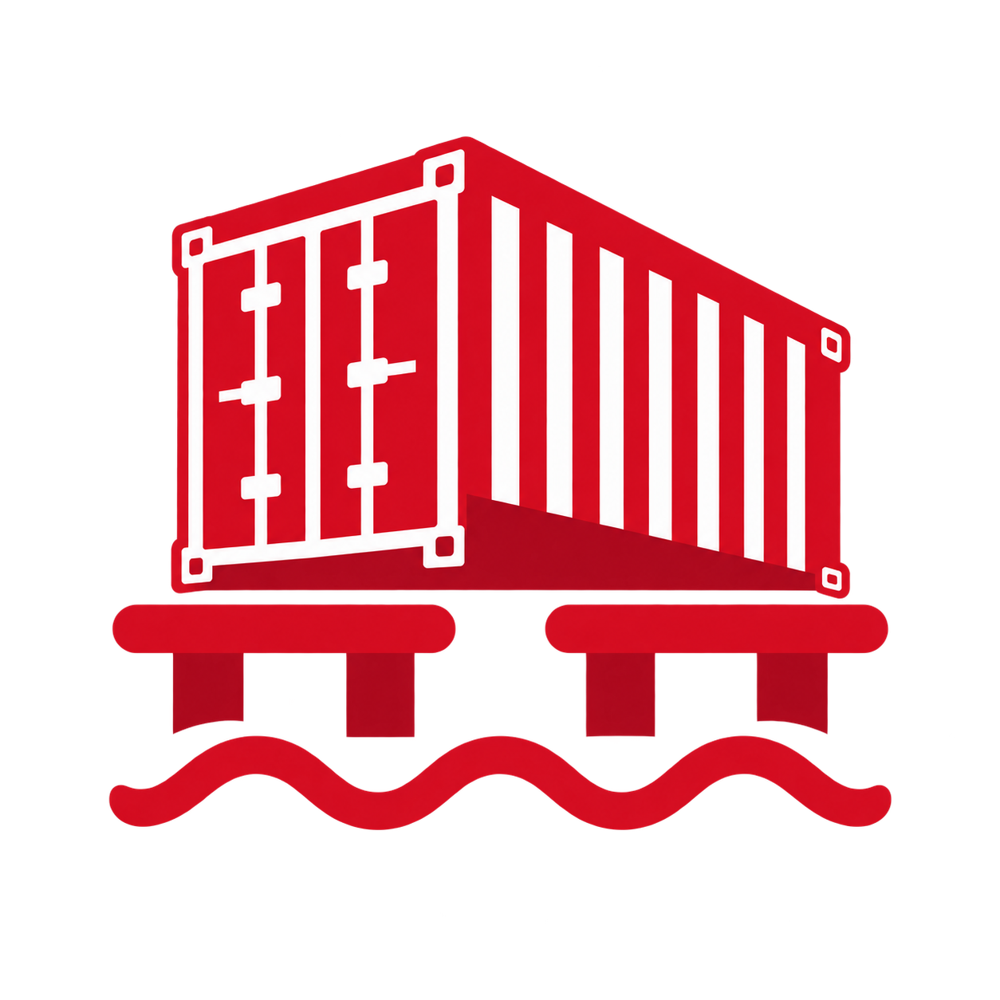
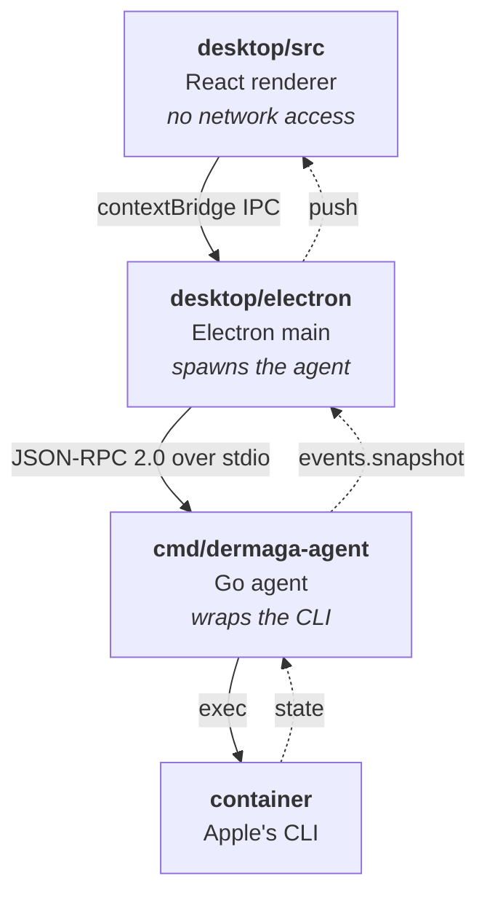
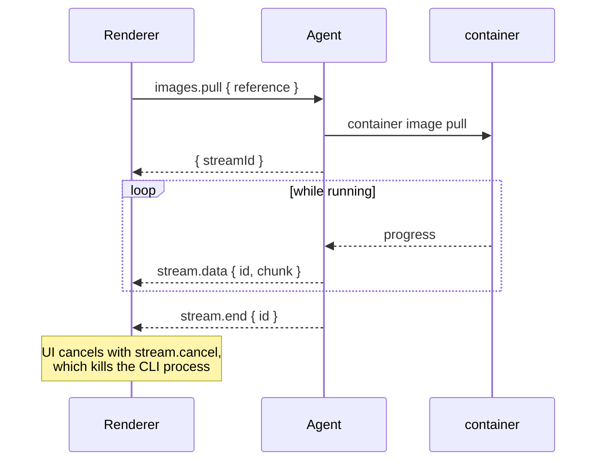

<p align="center">
  
</p>

<h1 align="center">Dermaga</h1>

<p align="center">
  A native macOS UI for Apple's <a href="https://github.com/apple/container"><code>container</code></a> runtime.<br>
  Manage containers, images, volumes, networks and machines without leaving the keyboard.
</p>

<p align="center">
  
  
  
</p>

---

Dermaga is a lightweight alternative to Docker Desktop for Apple Silicon. It runs no daemon, opens
no ports and polls nothing: a small Go agent wraps the `container` CLI, the UI subscribes to it, and
everything you do is immediately visible to `container ls` and vice versa.

## Features

- **Containers** — create, start, stop, restart, edit and remove; multi-select for bulk actions. Per
  container: live CPU and memory, IPv4/IPv6, gateway, MAC, MTU, DNS, mounts, environment,
  capabilities and runtime flags.
- **Terminal** — a real shell in any running container or machine, backed by a pty, with a prompt,
  line editing, colours and resize.
- **Logs** — follow container, machine and service logs, with filtering and follow-on-scroll.
- **Images** — pull with live progress, inspect layers, build history and the config a container
  inherits. Tags sharing a digest are shown as one image.
- **Volumes and networks** — create and delete, and see which containers depend on them.
- **Machines** — create, boot, stop, resize (CPU, memory, home mount) and delete the Linux VMs.
- **System** — start and stop the background services, read their logs, and reclaim disk space.
- **Live by default** — no refresh button anywhere. Changes made in a terminal appear within two
  seconds; changes made in Dermaga appear immediately.

## Install

Download the DMG from [Releases](https://github.com/ryanbekhen/dermaga/releases), open it and drag
Dermaga to Applications. The agent is inside the bundle — there is nothing else to install and no
separate service to run.

To build it yourself:

```bash
git clone https://github.com/ryanbekhen/dermaga.git
cd dermaga
make desktop-deps
make dist          # → desktop/release/Dermaga-<version>-arm64.dmg
make install       # or build and copy straight to /Applications
```

`make dist` refuses to produce a DMG that is missing the agent, the icon or a valid signature, so a
build either works on someone else's Mac or fails on yours.

**Requirements:** macOS 12+ on Apple Silicon and [Homebrew](https://brew.sh). Building from source
also needs Go 1.26+ and Node 18+.

You do not need to install Apple's `container` CLI yourself. On first launch Dermaga checks for it
and installs it through Homebrew, then starts the background services — see below.

## First launch

The splash screen is a bootstrap, not a progress bar. It runs five checks and fixes what it can:

1. **Starting the agent** — the Go process behind the app
2. **Checking Homebrew** — if it is missing, Dermaga explains why it is needed and closes, because
   nothing further can succeed
3. **Checking the container CLI** — installs it with `brew install container` if absent, showing the
   live progress
4. **Checking container services** — starts them if they are down
5. **Loading your containers**

Anything it cannot fix is reported there rather than dropped into an empty window. Kernel
installation stays opt-in: if the services fail to start because a kernel is missing, the app opens
on a screen that asks properly.

## Usage

```bash
make dev           # build the agent, then run Vite and Electron together
```

Preferences live in `~/.dermaga/config.json` as plain JSON, safe to edit by hand or keep in
dotfiles. Dermaga merges partial updates and repairs out-of-range values rather than failing.

| Shortcut     | Action        |
| ------------ | ------------- |
| `⌘K` or `⌘F` | Focus search  |
| `Esc`        | Clear search  |
| `⌘,`         | Open settings |

## Architecture

Three layers, each with one job. There is no HTTP server and no listening port — the agent is a
child process that speaks JSON-RPC on its own stdin and stdout, and dies with the app.



The agent holds no container state. Every call shells out; the only things it remembers are the last
stats sample, needed to turn cumulative CPU time into a percentage, and the last snapshot, needed to
tell when something actually changed.

### Go packages

```
cmd/dermaga-agent/   entrypoint: JSON-RPC on stdio
internal/cli/        runs `container`; the only package that touches os/exec
internal/containers/ list, lifecycle, spec, live stats
internal/images/     list, inspect, pull, delete, prune
internal/volumes/    ·  internal/networks/  ·  internal/machines/
internal/system/     services and disk usage
internal/settings/   ~/.dermaga/config.json
internal/terminal/   pty-backed shell sessions
internal/watcher/    one authoritative snapshot, pushed on change
internal/rpc/        framing, dispatch, streams
internal/agent/      wires domains to the RPC surface
internal/notify/     "something changed", so domains never import the watcher
```

A domain package never imports the watcher or the RPC layer; it takes a `notify.Notifier` instead.
`internal/agent` is the only seam where domains meet transport.

### Streams

Logs, pulls, machine creation and terminals are long-running, so they are streams rather than calls.



### RPC surface

| Method                                                                                | Notes                                    |
| ------------------------------------------------------------------------------------- | ---------------------------------------- |
| `system.status` `system.start` `system.stop`                                          | Services, CLI version, kernel opt-in     |
| `system.diskUsage` `system.prune` `system.logs`                                       | Disk usage and reclaiming                |
| `settings.get` `settings.save`                                                        | Preferences on disk                      |
| `containers.list/get/spec/start/stop/remove/update`                                   | Lifecycle                                |
| `images.list/inspect/delete/prune`                                                    | Images                                   |
| `volumes.*` `networks.*`                                                              | List, create, delete                     |
| `machines.list/get/start/stop/delete/setDefault/configure`                            | Machine lifecycle                        |
| `events.subscribe`                                                                    | Pushes `events.snapshot` on every change |
| `containers.create` `containers.logs` `images.pull` `machines.create` `machines.logs` | Streams                                  |
| `terminal.open/input/resize` `stream.cancel`                                          | pty sessions, base64 payloads            |

## Behaviour worth knowing

**Editing a container recreates it.** Apple's CLI has no `update` verb, so saving the edit form
stops, deletes and re-runs the container with the new spec. Named volumes survive; the container
filesystem does not, and the form says so before you commit. If the new spec fails to start, the
previous container is restored.

**Deleting an image removes every tag pointing at it.** References that share a digest are one
image, and removing a single tag would leave the bytes on disk under another name.

**Machines and containers are separate.** Containers run inside a Linux VM ("machine"). If nothing
starts, check **System** — without the background services running, nothing else can work, and
Dermaga replaces its whole window with a button to start them.

**The CLI updates from inside the app.** System shows the installed `container` version and offers an
update when Homebrew has a newer one. The check reads Homebrew's local index rather than running
`brew update`, so it costs nothing and never mutates your Homebrew state on its own. A CLI installed
from Apple's `.pkg` is left alone — upgrading that means an installer asking for a password.

## Development

```bash
make check     # go vet, go test, tsc, eslint
make fmt       # gofmt and prettier
make icon      # regenerate the app and splash icons from assets/logo.png
make clean
```

### Signing

Apple Silicon refuses to launch a bundle whose signature does not verify, so unsigned builds are
ad-hoc signed by `desktop/build/afterPack.cjs`. That is enough to run on the machine that built it,
but **not** enough for a Mac that downloaded it: Gatekeeper quarantines the file and blocks it.

Two ways to hand a build to someone else:

**Signed and notarized** — nothing to explain to the recipient. Provide credentials and the build
switches to a Developer ID identity, turns on the hardened runtime and notarizes:

```bash
CSC_NAME="Developer ID Application: Your Name (TEAMID)" \
APPLE_ID=you@example.com \
APPLE_APP_SPECIFIC_PASSWORD=xxxx-xxxx-xxxx-xxxx \
APPLE_TEAM_ID=TEAMID \
make dist
```

**Unsigned** — the recipient right-clicks the app and chooses **Open** the first time, or clears the
quarantine flag:

```bash
xattr -dr com.apple.quarantine /Applications/Dermaga.app
```

### Releasing

```bash
make release VERSION=1.1.0
```

Runs the checks, bumps the version, tags `v1.1.0`, pushes, builds the DMG and publishes a GitHub
release with generated notes and the artefact attached. It refuses to start on a dirty tree, a
failing check, or an existing tag.

The version and commit are stamped into the binary at link time, and the app reports them in the
bottom-right of the status bar — so any running build can be traced back to the commit it came from.
`make version` prints what the next build would report.

### Permissions

Dermaga needs no macOS permissions of its own: no network access, no disk access prompts, no
accessibility, no admin password. It runs Apple's CLI as your user and talks to its agent over a
pipe. The two things it does ask about, it asks in the UI: installing the `container` CLI through
Homebrew, and installing a kernel if the services need one.

> **Launching from an Electron-based terminal:** VS Code, Cursor and Claude Code export
> `ELECTRON_RUN_AS_NODE=1`, which makes a packaged Electron app exit immediately. Launch from Finder,
> or clear it: `env -u ELECTRON_RUN_AS_NODE open desktop/release/mac-arm64/Dermaga.app`.

See [CONTRIBUTING.md](CONTRIBUTING.md) before opening a pull request.

## License

[MIT](LICENSE)
